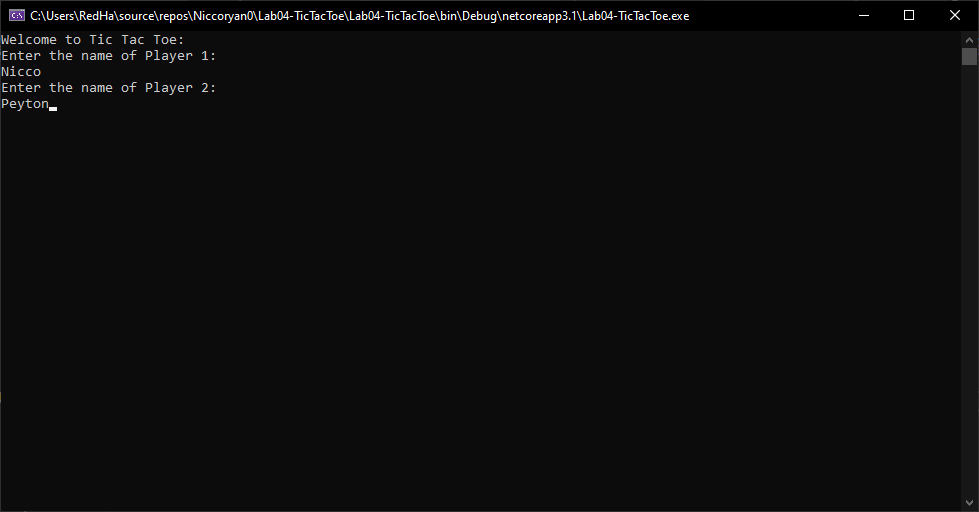
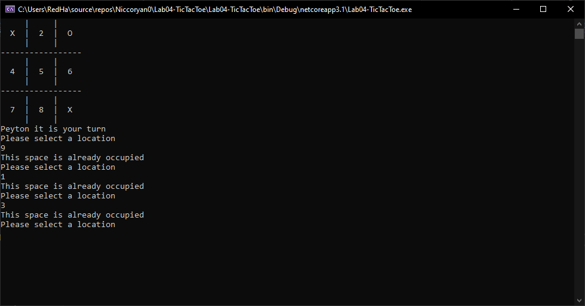
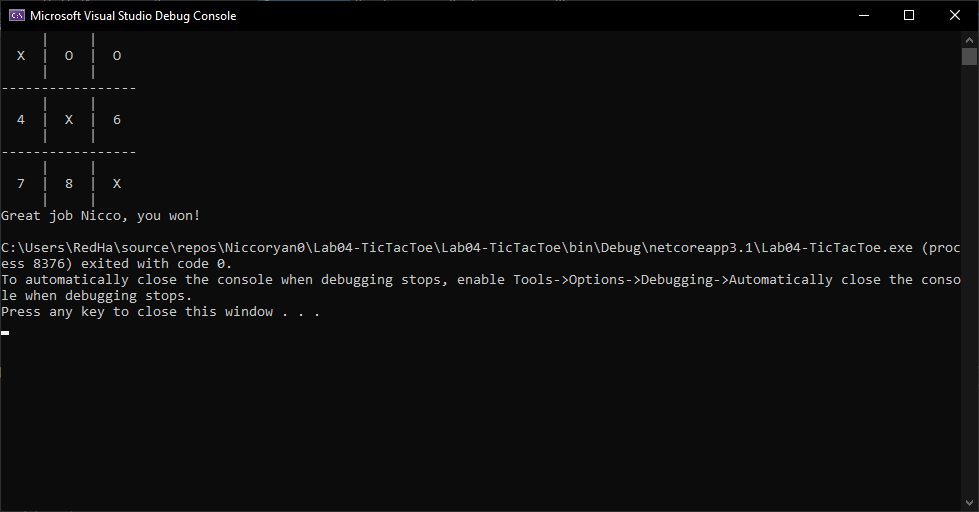

# Lab 03 - Tic Tac Toe

*Author: Nicco Ryan, Na'ama Bar-llan, Peyton Cysewski*

----

## Description
#### This is a console application that allows users to play a standard game of tic-tac-toe with two players.
---

### Getting Started
Clone this repository to your local machine.

```
$ git clone https://github.com/Niccoryan0/Lab04-TicTacToe.git
```

### To run the program from Visual Studio:
Select ```File``` -> ```Open``` -> ```Project/Solution```

Next navigate to the location you cloned the Repository.

Double click on the ```Lab04-TicTacToe``` directory.

Then select and open ```Lab04-TicTacToe.sln```

---


### Visuals
#### Application Start

#### Application in Action


#### Application End



---

### Change Log
1.0: *Initial release* - 9 July 2020